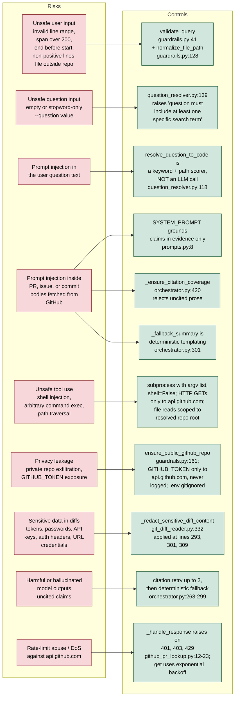

# Git Explainer Agent — Design Document

CIS 1990 Final Project. Authors: Andrei and Alistair.

Architectural reference for the code in this repository. User-facing
usage lives in [README.md](../README.md); eval results and critique
live in [eval/testing_metrics.md](../eval/testing_metrics.md).

## 1. Scope

The agent takes a local git clone plus either a line range or a
natural-language question, and returns a structured JSON
[ExplanationResult](../git_explainer/orchestrator.py#L43) with five
synthesis sections (`what_changed`, `why`, `tradeoffs`, `limitations`,
`summary`) plus the commits, pull requests, issues, file contexts, and
diffs that back them, cache statistics, and a `used_fallback` flag.

Input shapes, validated in
[guardrails.py:41](../git_explainer/guardrails.py#L41):

1. `(repo_path, file_path, start_line, end_line)` — direct line-range mode.
2. `(repo_path, --question ...)` with an optional `file_path` hint —
   resolved to a concrete span before tracing.

Out of scope: non-GitHub hosting, private repos (refused by default —
`enforce_public_repo=True`, opt out via `--allow-private-repo`),
binary files, cross-repository traces.

## 2. System flow

A single invocation of `python main.py ...` flows through CLI entry,
`validate_query`, optional question-to-code resolution,
`trace_line_history` (with a `search_commits` fallback when the line
trace returns nothing), per-commit evidence collection with
`ExplainerMemory` caching, a pre-synthesis evidence-condensation pass
(so long PR/issue threads do not overflow the synthesis prompt),
synthesis (LLM with citation-coverage validation, otherwise a
deterministic fallback), and JSON emission. Guardrail checks
(double-octagon nodes) can terminate the run by raising `ValueError`.
Cylinders represent reads or writes against `ExplainerMemory`.

```mermaid
flowchart TD
    Start([python main.py ...])
    Mode{"--question flag set?"}
    LineEntry["Line-range mode<br/>repo file_path start end"]
    QEntry["Question mode<br/>repo --question '...'"]
    Validate{{"validate_query<br/>guardrails.py:41"}}
    Error([ValueError raised to user])
    Resolve["resolve_question_to_code<br/>question_resolver.py:118"]
    RevalidatePQ{{"validate_query<br/>on resolved span<br/>guardrails.py:41"}}
    TraceLines["trace_line_history<br/>git_blame_trace.py"]
    NoCommits{"commits list empty?"}
    SearchCommits["search_commits fallback<br/>commit_search.py"]
    Loop["For each commit in<br/>commits up to max_commits"]
    MemRead[("ExplainerMemory.get_*<br/>commit PRs, PR body,<br/>PR comments, issue,<br/>issue comments,<br/>file context, diff")]
    PRLookup["fetch_pr + fetch_pr_comments<br/>github_pr_lookup.py"]
    IssueRefs["extract_issue_refs<br/>from commit + PR bodies"]
    IssueLookup["fetch_issue + fetch_issue_comments<br/>github_issue_lookup.py"]
    FileCtxGuard{{"should_fetch_file_context<br/>guardrails.py:176"}}
    FileCtx["read_file_at_revision<br/>file_context_reader.py"]
    Diff["get_diff<br/>git_diff_reader.py<br/>with credential redaction"]
    MemWrite[("ExplainerMemory.set_*<br/>on every cache miss")]
    Condense["condense_evidence<br/>evidence_condenser.py<br/>two-tier: LLM summary<br/>then heuristic truncation<br/>if payload &gt; EVIDENCE_CHAR_BUDGET"]
    Synth{"use_llm AND<br/>is_available()?"}
    LLMCall["chat<br/>llm.py<br/>uses SYSTEM_PROMPT +<br/>build_synthesis_prompt"]
    CitationCheck{{"_ensure_citation_coverage<br/>orchestrator.py:420"}}
    Retry{"attempts under 2?"}
    Fallback["_fallback_summary<br/>deterministic templating<br/>orchestrator.py:301"]
    Flush["memory.flush()<br/>orchestrator.py:123"]
    Result([JSON ExplanationResult<br/>printed to stdout<br/>originals preserved;<br/>only synthesis sees condensed])

    Start --> Mode
    Mode -->|no| LineEntry
    Mode -->|yes| QEntry
    LineEntry --> Validate
    QEntry --> Validate
    Validate -->|invalid input| Error
    Validate -->|question mode, ok| Resolve
    Validate -->|line mode, ok| TraceLines
    Resolve --> RevalidatePQ
    RevalidatePQ -->|invalid| Error
    RevalidatePQ -->|ok| TraceLines
    TraceLines --> NoCommits
    NoCommits -->|yes, no commits| SearchCommits
    NoCommits -->|no| Loop
    SearchCommits --> Loop
    Loop --> MemRead
    MemRead -->|cache hit| FileCtxGuard
    MemRead -->|miss: PR data| PRLookup
    PRLookup --> MemWrite
    MemWrite --> IssueRefs
    IssueRefs --> IssueLookup
    IssueLookup --> MemWrite
    MemWrite --> FileCtxGuard
    FileCtxGuard -->|needs context| FileCtx
    FileCtxGuard -->|skip| Diff
    FileCtx --> MemWrite
    MemWrite --> Diff
    Diff --> MemWrite
    MemWrite --> Condense
    Condense --> Synth
    Synth -->|LLM on| LLMCall
    Synth -->|LLM off or unavailable| Fallback
    LLMCall --> CitationCheck
    CitationCheck -->|pass| Flush
    CitationCheck -->|uncited prose| Retry
    Retry -->|yes, re-prompt| LLMCall
    Retry -->|no, give up| Fallback
    Fallback --> Flush
    Flush --> Result

    classDef guardrail fill:#fff3cd,stroke:#856404,stroke-width:2px,color:#000
    classDef errorNode fill:#f8d7da,stroke:#842029,stroke-width:2px,color:#000
    class Validate,RevalidatePQ,FileCtxGuard,CitationCheck guardrail
    class Error errorNode
```



## 3. Tools

Each tool under [git_explainer/tools/](../git_explainer/tools/) is a
thin module with one job:

- **[git_blame_trace](../git_explainer/tools/git_blame_trace.py#L86)** —
  primary tracer. `git log -L` first, then `git blame -M` with
  `.git-blame-ignore-revs` and `git log --follow -M` as fallbacks.
- **[github_pr_lookup](../git_explainer/tools/github_pr_lookup.py)** —
  `find_prs_for_commit`, `fetch_pr`, `fetch_pr_comments`.
- **[github_issue_lookup](../git_explainer/tools/github_issue_lookup.py)** —
  `extract_issue_refs`, `fetch_issue`, `fetch_issue_comments`.
- **[file_context_reader](../git_explainer/tools/file_context_reader.py)** —
  reads file contents at a given revision.
- **[git_diff_reader](../git_explainer/tools/git_diff_reader.py)** —
  compact per-commit diff summaries with credential redaction
  ([_redact_sensitive_diff_content](../git_explainer/tools/git_diff_reader.py#L332)).
- **[commit_search](../git_explainer/tools/commit_search.py)** —
  last-resort `git log` wrapper used when line tracing returns nothing.
- **[question_resolver](../git_explainer/tools/question_resolver.py)** —
  maps a natural-language question to a concrete line span using AST
  parsing for Python files and keyword matching elsewhere. Not an LLM
  call.

All external fetches are cached in the JSON-backed
[ExplainerMemory](../git_explainer/memory.py#L27) (stored at
`.git_explainer_cache.json` inside the target repo, seven buckets keyed
by shape).

## 4. Guardrails

- **Line span** capped at `DEFAULT_MAX_LINE_SPAN = 200`
  ([guardrails.py:71-76](../git_explainer/guardrails.py#L71-L76)).
- **Positive integers and ordering**: `start_line`, `end_line > 0` and
  `end_line >= start_line`
  ([guardrails.py:66-69](../git_explainer/guardrails.py#L66-L69)).
- **File existence**: missing or binary files raise
  ([guardrails.py:117-125](../git_explainer/guardrails.py#L117-L125)).
- **Repository containment**: [normalize_file_path](../git_explainer/guardrails.py#L128)
  rejects paths outside the repo root.
- **Private-repo refusal (default on)**: `enforce_public_repo` now
  defaults to `True`. The guardrail calls
  [ensure_public_github_repo](../git_explainer/guardrails.py#L161),
  which rejects 404 or `private: true`. Opt out at the CLI with
  `--allow-private-repo` or programmatically by constructing
  [ExplainerQuery](../git_explainer/guardrails.py#L24) with
  `enforce_public_repo=False`.
- **Parameter clamping**: `max_commits` ∈ `[1, 20]`, `context_radius`
  ∈ `[0, 200]`
  ([guardrails.py:102-103](../git_explainer/guardrails.py#L102-L103)).
- **Citation coverage**: [_ensure_citation_coverage](../git_explainer/orchestrator.py#L420)
  rejects synthesized sentences without a bracketed citation and
  triggers the retry loop.

## 5. Evidence pre-summarization (condensation)

Long GitHub threads can easily overflow the synthesis model's context
window. Between evidence collection and synthesis, the orchestrator
invokes
[condense_evidence](../git_explainer/evidence_condenser.py) on the
collected payload (commits, pull requests, issues, file contexts,
diffs).

Trigger threshold. If the serialized evidence dict is at or under
[config.EVIDENCE_CHAR_BUDGET](../git_explainer/config.py#L45) (default
`30000` characters, overridable via the `EVIDENCE_CHAR_BUDGET` env
var), condensation is a no-op and the report's `method_used` is
`"none"`. Only when the payload exceeds the budget does the condenser
run.

Two-tier strategy. For each eligible field, longest first:

1. Tier 1 (preferred): the LLM is asked for a concise summary
   (`EVIDENCE_SUMMARY_TARGET_CHARS`, default `800`) that explicitly
   preserves commit SHAs, PR/issue numbers, file paths, technical
   trade-offs, and stated intent. Output is prefixed with
   `[pre-summarized]` in the condensed copy.
2. Tier 2 (fallback): deterministic head+tail truncation with a
   visible elision marker (`[... content truncated: N chars elided
   ...]`). Used when the LLM is unavailable or returns an empty
   reply. Output is prefixed with `[truncated]`.

Fields touched vs. preserved. Condensation is intentionally narrow:

- **Condensed**: `pull_requests[i].body`,
  `pull_requests[i].review_comments[j].body`, `issues[i].body`,
  `issues[i].comments[j].body`, only when length exceeds
  [config.EVIDENCE_FIELD_MAX_CHARS](../git_explainer/config.py#L46)
  (default `3000`).
- **Preserved verbatim**: all commit SHAs (full and short),
  PR/issue numbers, titles, labels, URLs, `file_contexts` entries,
  `diffs` entries, and any other structural metadata.

Report shape. The condenser returns a
[CondensationReport](../git_explainer/evidence_condenser.py#L35)
serialized as the `condensation` field of the
[ExplanationResult](../git_explainer/orchestrator.py#L44):

```json
"condensation": {
  "original_size": 48123,
  "condensed_size": 22041,
  "fields_condensed": ["pr#42.body", "issue#7.comments[2].body"],
  "method_used": "llm"   // "none" | "llm" | "heuristic" | "mixed"
}
```

Caller visibility. The `ExplanationResult` returned to the caller
still contains the **un-condensed originals** for
`pull_requests`, `issues`, `file_contexts`, and `diffs`. Only the
synthesis LLM sees the condensed view, via
`build_synthesis_prompt(condensed_evidence, ...)` in
[orchestrator.py](../git_explainer/orchestrator.py#L133). Downstream
consumers (notebooks, eval harness, `--use-llm-judge`) therefore score
the agent against the full evidence, not the compressed view.

## 6. Threat model

The diagram maps each risk to the control that addresses it, with
file:line references.



## 7. Evaluation

Scored by [eval/evaluate.py](../eval/evaluate.py) against 20 benchmark
cases in [eval/benchmark.json](../eval/benchmark.json).
[eval/results.json](../eval/results.json) is the fallback-only run
covering 16 cases (the other four require `use_llm=True` or an external
repo clone); [eval/results.notebook.json](../eval/results.notebook.json)
has the aggregated summary plus the four LLM-on cases.

| Metric | Target | Actual |
|---|---|---|
| Retrieval accuracy | 85% | 100% (5 / 5 gold targets, notebook run) |
| Summary faithfulness | 80% | 5.00 / 5.00 on proxy rubric (not human-rated) |
| Citation coverage | 100% | 100% (27 / 27 citable sentences) |
| Citation validity | — | 100% (53 / 53 citations resolve to real evidence) |
| Pass rate | — | 16 / 16 on the non-LLM subset |
| Latency p50 | — | 0.063s fallback / 0.150s LLM |
| Latency p95 | — | 1.094s fallback / 0.192s LLM |

The faithfulness rubric is a deterministic proxy, not a human rater;
the proposal's 80% target assumed human rating and is not yet measured.
